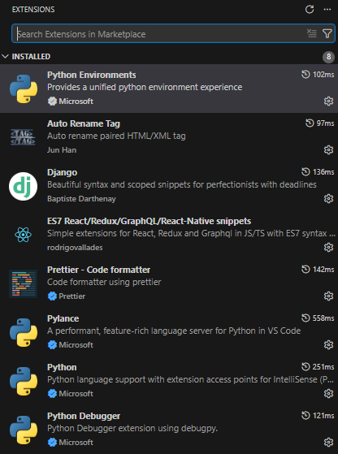

Как запустить прогу:

1) Запускаете терминал (я делал это в VSCode)

2) Прописываете venv\Scripts\activate
  - потом разделяете терминал и пишете:

    front:
      cd frontend
      npm start

    back:
      cd backend
      python manage.py runserver

Extensions:

